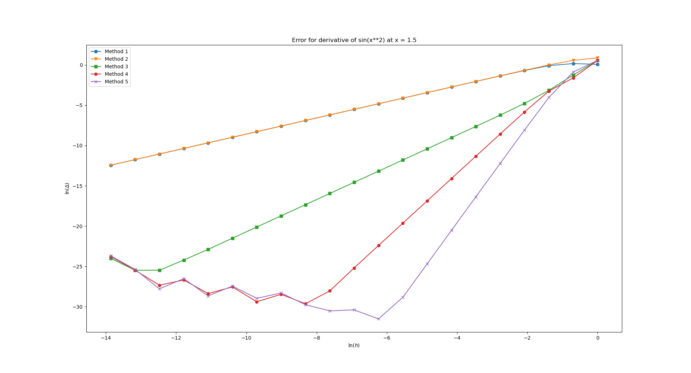
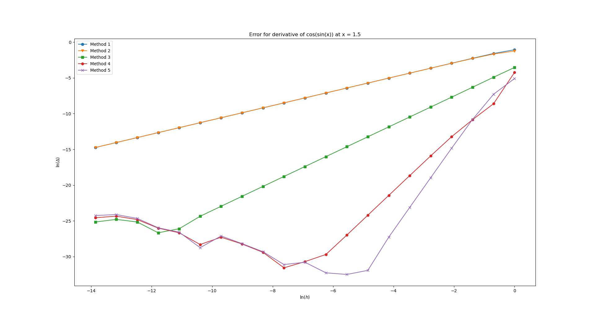
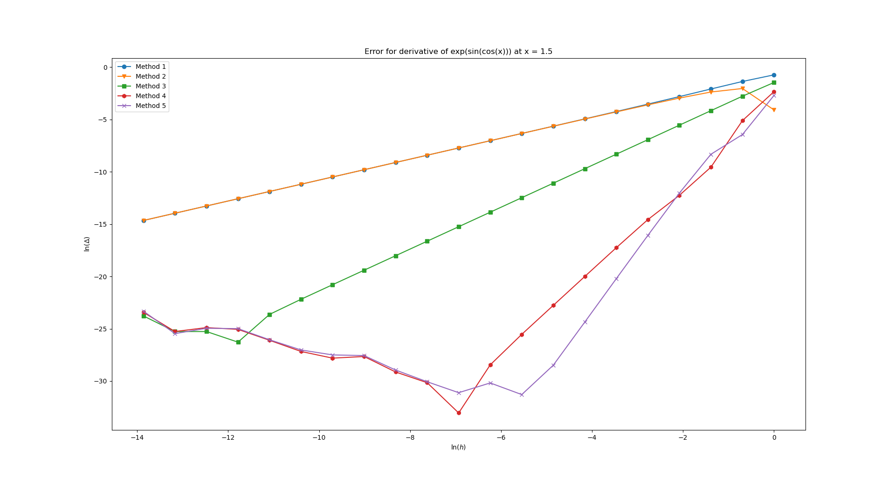
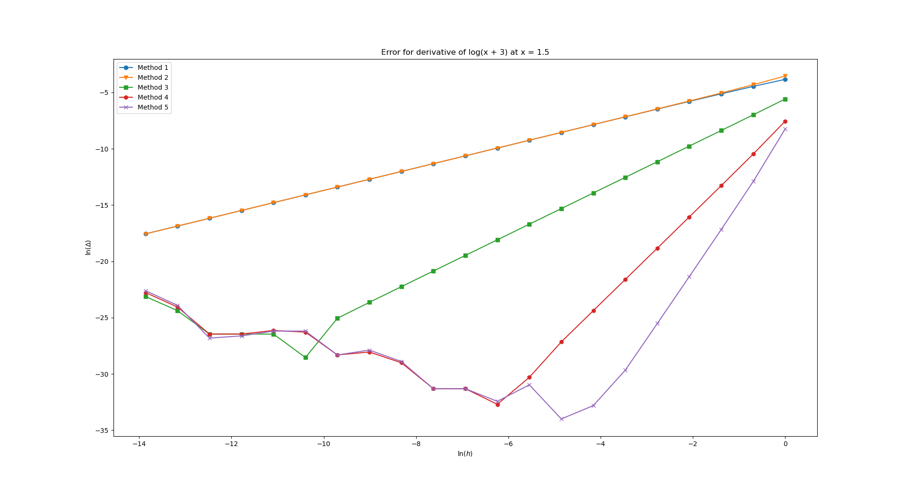
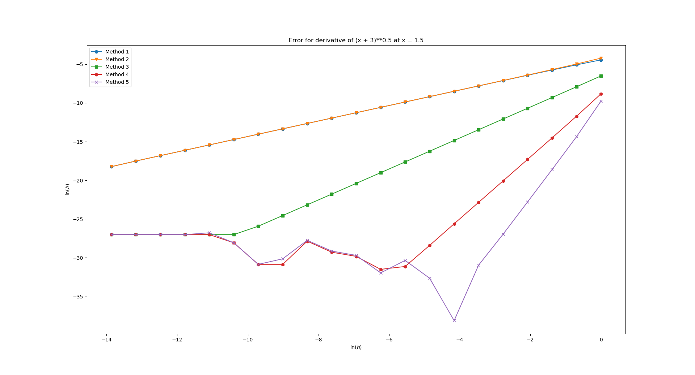

Numerical derivative
===========================
The error of numerical derivative is studied depending on the step: $$h = \frac{2}{2^n}, n=\overline{1,21}$$

The functions for which the derivative will be calculated:
- $$\sin(x^2)$$
- $$\cos(\sin(x))$$
- $$\exp(\sin(\cos(x)))$$
- $$\ln(x+3)$$
- $$(x+3)^{0.5}$$

The numerical derivative formulas:
- $$\frac{f(x+h)-f(x)}{h}$$
- $$\frac{f(x)-f(x-h)}{h}$$
- $$\frac{f(x+h)-f(x-h)}{2h}$$
- $$\frac{4}{3}\frac{f(x+h)-f(x-h)}{2h}-\frac{1}{3}\frac{f(x+2h)-f(x-2h)}{4h}$$
- $$\frac{3}{2}\frac{f(x+h)-f(x-h)}{2h}-\frac{3}{5}\frac{f(x+2h)-f(x-2h)}{4h} + \frac{1}{10}\frac{f(x+3h)-f(x-3h)}{6h}$$

Results
================
##### $$\sin(x^2)$$

##### $$\cos(\sin(x))$$

##### $$\exp(\sin(\cos(x)))$$

##### $$\ln(x+3)$$

##### $$(x+3)^{0.5}$$

