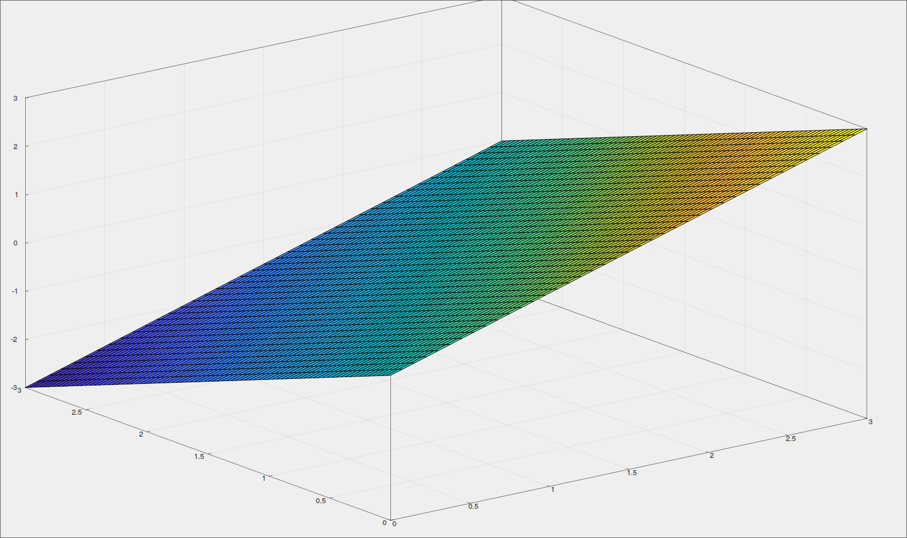

# Convection Diffusion Equation
## Problem
Solve equation du/dx + du/dt = 0 using 3 schemes:
- explicit three-point
- cross
- Lax-Wendroff

We will solve equation du/dx + du/dt = 0 with boundary conditions u(x, 0) = x, u(0, t) = -t. The analytical solution is u(x, t) = x - t. Then we calculate discrepancy for each method.

## Results
Steps: h = 3 / 40, t = 3 / 80
| Scheme | discrepancy |
| ------ | ----------- |
| Three-point | 5.107e-15 |
| Cross | 5.7732e-15 |
| Lax-Wendroff | 6.21e-15 |

U(x,t) three-point scheme:

U(x,t) cross scheme:

U(x,t) Lax-Wendroff scheme:

## Build
### Dependencies
- clang >= 18.0 or gcc >= 14.0
- meson
### Setup
~~~
git clone https://github.com/krisszzzz/computational_math
cd 8-Convection-Diffusion-Equation
meson setup build
~~~
